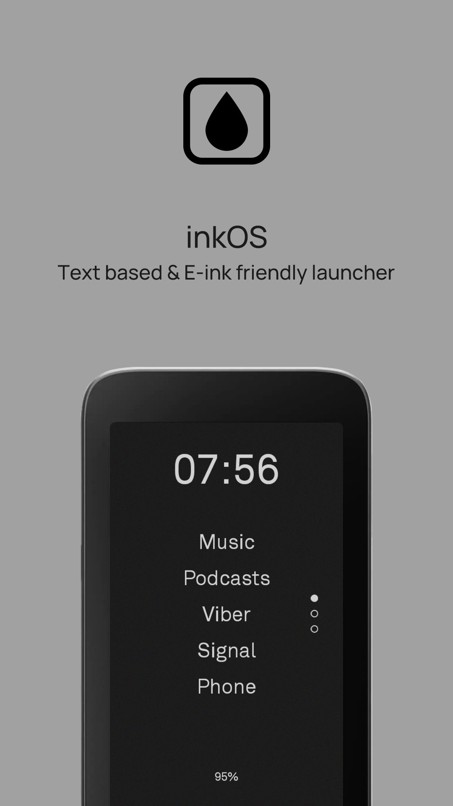
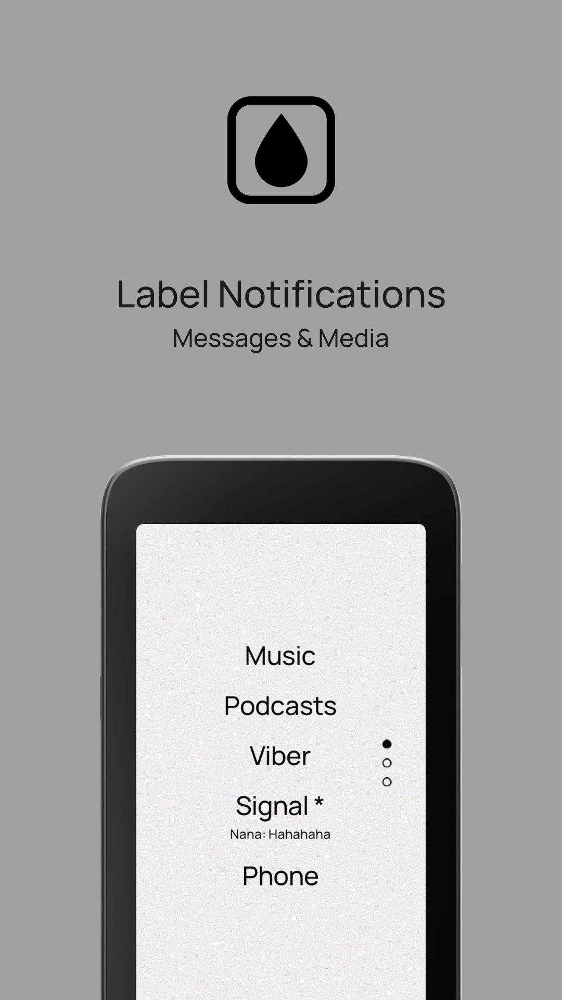
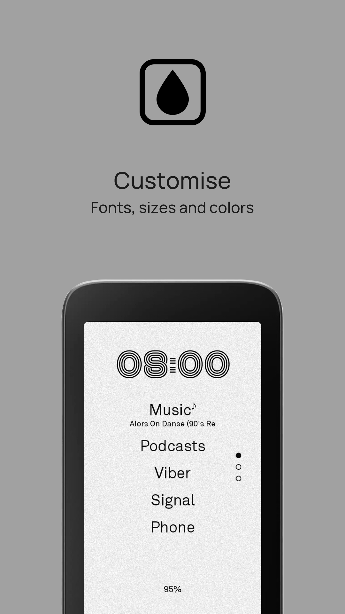
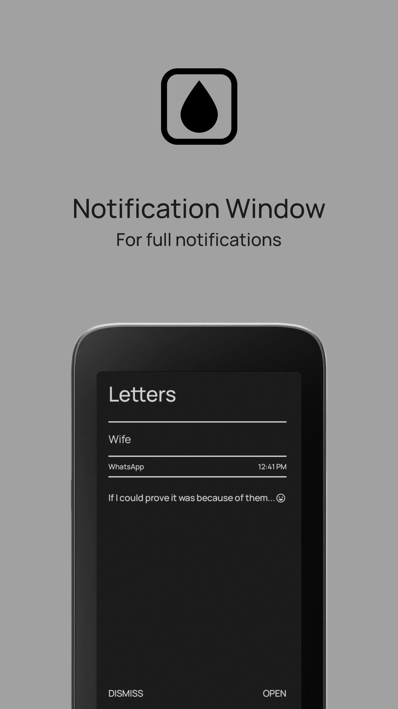

	<h2>inkOS - Text based & E-ink friendly Android Launcher </h2>
    <table>
        <tr>
            <td></td>
            <td></td>
            <td></td>
            <td></td>
        </tr>
    </table>

Click on any image to enlarge it. To know more, read [documentation](DOCUMENTATION.md).

If you want to see the launcher visually before you try you can [watch my video on YouTube](https://www.youtube.com/watch?v=dAmHJ5aFLWA)

# Tested on Android 10 to 16.

It works well with these minimal/dumbphone devices:

- Mudita Kompakt
- LightPhone 3 (tested on emulator)
- QIN F22
- Cat S22 flip

# Downloading

You can download the apk directly on the Release section on the rightside of github, or you can use a manager like IzzyOnDroid. It might come on F-Droid in the future once I figure it out.

# Forked with extra features

List of features (click to expand)

- No ads, trackers, or unnecessary permissions (no internet permission).
- Reorder apps on the home screen by drag & drop.
- Rename, hide, lock, or uninstall apps from the app drawer.
- Customize font size and style for:
    - Home screen apps
    - Clock
    - Battery widget
    - Notifications
    - Settings
- Set a universal font or individually customize each text section.
- Fine-tune padding (spacing) between home screen apps.
- Set how many apps appear on the home screen and how many pages exist.
- Page indicators (dots) show your current page on the right side.
- Optionally show clock and battery widgets on the home screen.
- Gesture support:
    - Swiping left/right
    - Clicking the clock
    - Double-tap
    - Volume key page navigation
    - (Actions: open app, open notifications, restart launcher, disable gesture, more)
- Full notification control:
    - Show message previews under app names
    - Show media playing info (title, music note icon)
    - Use app allowlist for chat/media apps
    - Optional full-screen notification reader window
- E-ink mode auto-refresh to clean up ghosting (for e-ink devices).
- Theme mode (light/dark), with color options for AMOLED (not recommended for e-ink).
- Show or hide the status bar (carrier, clock, battery, etc.).
- Lock settings or individual apps with PIN/fingerprint.
- Long-press apps for quick access to system info or force-stop.
- Backup and restore your setup across devices (excludes custom fonts).
- Clean “Reset All” option to return to default.

## Permissions

inkOS uses the following permissions:

- `android.permission.EXPAND_STATUS_BAR`
    - Allows the launcher to expand or collapse the status bar (for gestures and quick access).
- `android.permission.QUERY_ALL_PACKAGES`
    - Allows the launcher to list all installed apps, so you can see and manage them.
- `android.permission.REQUEST_DELETE_PACKAGES`
    - Allows the launcher to request the uninstallation of apps (user confirmation required).
- `android.permission.USE_BIOMETRIC`
    - Enables PIN or fingerprint lock for apps or settings.
- `android.permission.SYSTEM_ALERT_WINDOW`
    - Required for overlay features, such as showing notifications or dialogs over other apps.
- `android.permission.FOREGROUND_SERVICE`
    - Allows the launcher to run foreground services for persistent features (e.g., notification
      listener).
- `android.permission.VIBRATE`
    - Enables vibration feedback for certain actions.

> **Note:** inkOS does not request internet access and does not collect or transmit any data.

## License

inkOS is open source under the GPLv3 license, giving you the freedom to use, study, modify, and
distribute it. The Copyleft provision ensures these freedoms remain intact, so inkOS will always be
fully open source and customizable by anyone.

- inkOS does not have network access.
- inkOS does not collect or transmit any data in any way whatsoever.

## Credits

- [https://github.com/DroidWorksStudio/mLauncher](https://github.com/DroidWorksStudio/mLauncher)
- [https://github.com/tanujnotes/Olauncher](https://github.com/tanujnotes/Olauncher)
- [https://github.com/OlauncherCF/OlauncherCF](https://github.com/OlauncherCF/OlauncherCF)

## Donation
